# What Came First

## Table of Contents

* [1. Introduction](#1.Introduction)
* [2. User Design Experience (UX)](#2.User-Design-Experience)
* [3. Features](#3.Features)
* [4. Technologies Applied](#4.Technologies-applied)
* [5. Testing](#5.Testing)
* [6. Deployment](#6.Deployment)
* [7. Credits](#7.Credits)

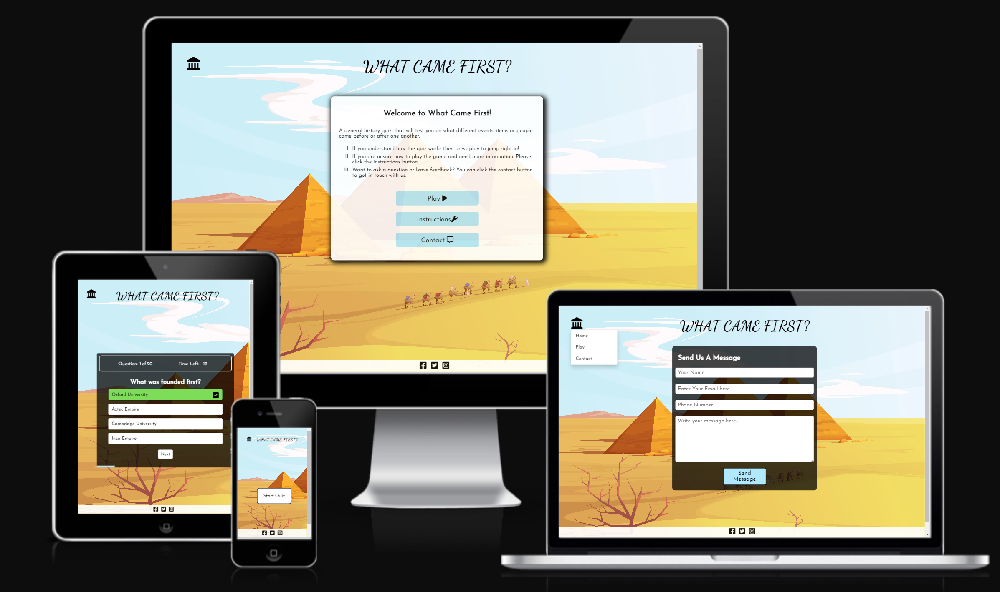

The Website is responsive, this allows site visitors to interact with the platform on a variety of devices. This may range from, desktops, laptops, tablets and mobiles. 

Please see above a mockup of the website on a range of devices. 

To view the deployed site, click this link: [What Came First](https://megwana.github.io/whatcamefirst)

## 1. Introduction

### Introduction & Premise 

A quiz is classed a game or even a sport for the mind. People either individually or in a team try to answer questions correctly on an array of topics. To read more about this, [click here](https://en.wikipedia.org/wiki/Quiz).

What Came First is a website designed for visitors to learn and test their knowledge on general history. The goal for the user is to play the quiz game and try and guess what historical event, place or person came first from the selection of options. 

### Goals 

- New Vistitors to the site: 

For new visitors, I have the following goals depending on different factors. 
If the visitors already has a good sense of general knowledge then I want this to be a fun experience for them as a quiz game.
If the visitor does not know much about history, then I want the user to have learnt and gained knowledge after completing the quiz. 
As the user is a new visitor, I want them to find the website easy to navigate. I want them to find the rules easy to understand. In addition, I would like them to find the website visually clear to read and appealing design wise. 

- Regular Visitors to the site: 

For regular visitors, I want them to keep coming back. Therefore as time transpires, I will look to add more questions and quizes to the website. 

- All visitors:

I want all visitors to have had a fun and interactive experience whilst completing the quiz. 
I want them to find the site easy to navigate.
My target audience is anyone with a curious mind. I hope those who answer the majority of the quiz correctly, enjoyed the questions and felt challenged at times or if they have any feedback on how to make it more challenging; they can get in contact via the contact page.
Furthermore, I hope those who did not score highly, managed to learn something new and either reasearch more about a question topic in their own time or decide to get in touch via the contact page. 

## 2. User Design Experience (UX)

### Conceptualisation

The original concept for this website is based off of the board game (link referenced below):
https://www.amazon.co.uk/First-Board-Picking-Betting-Big/dp/B07VGLK2BY

The website is however, a quiz game with its prime goal to be that people may have learnt something new after participating.

Whereas the board game has a more competitive element and a betting structure.

### Wireframes

As the quiz isn't just general trivia and is specifically on various historical people, places and events that occured: I wanted the insert a background image that embodies ancient history. For me, an image of the Pyramids was perfect to capture this. In addition, I wanted it display also a fun lightness to it. Therefore, a cartoon of the Pyramids I thought aided this well. 

I created Wireframes for mobile, tablet and desktop devices using Figma. 

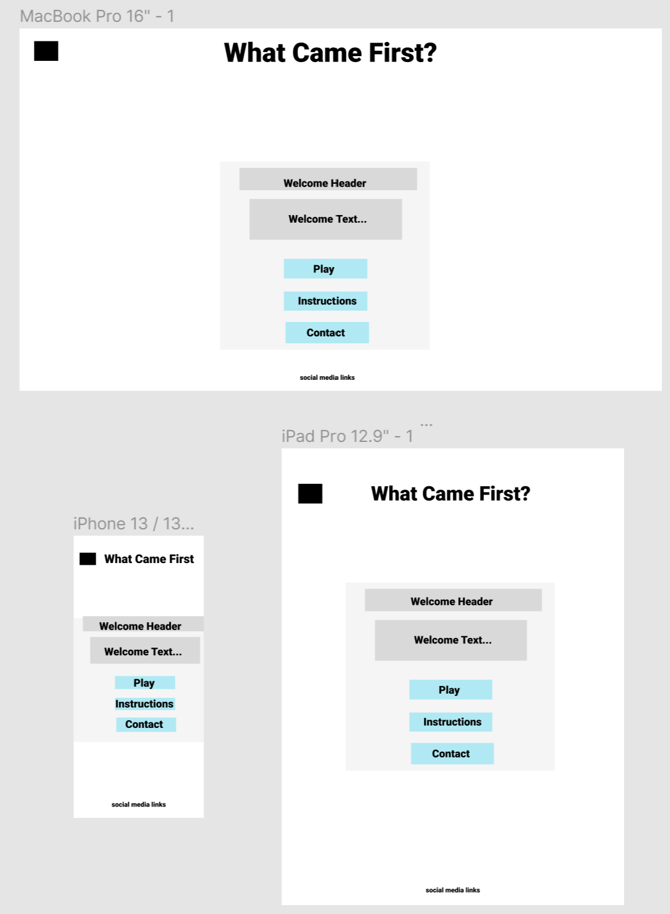
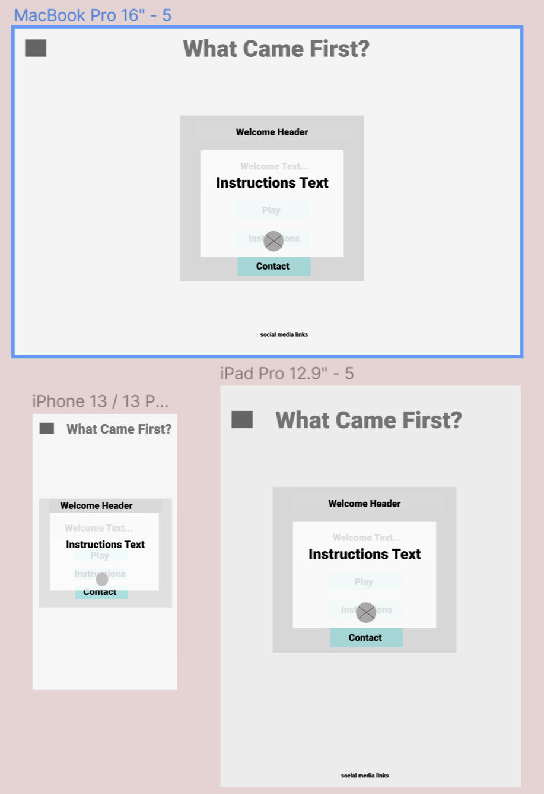
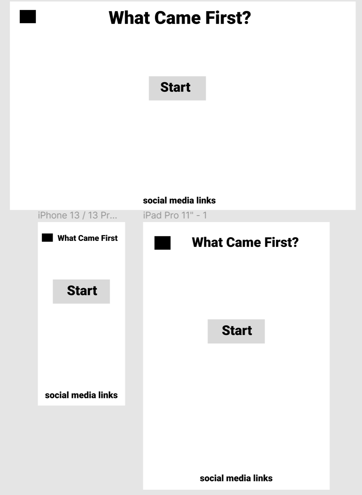
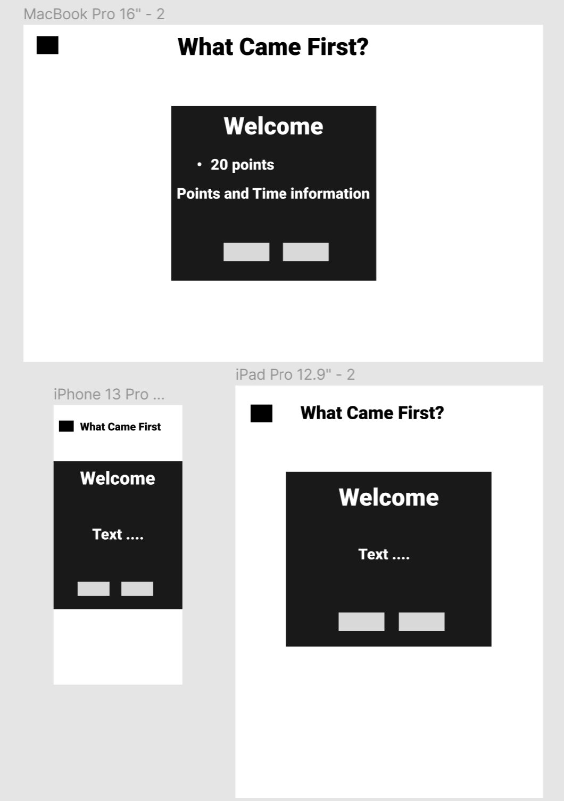
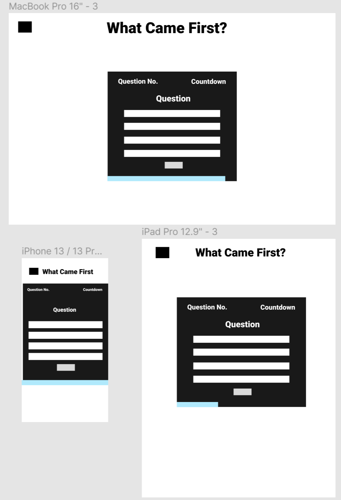
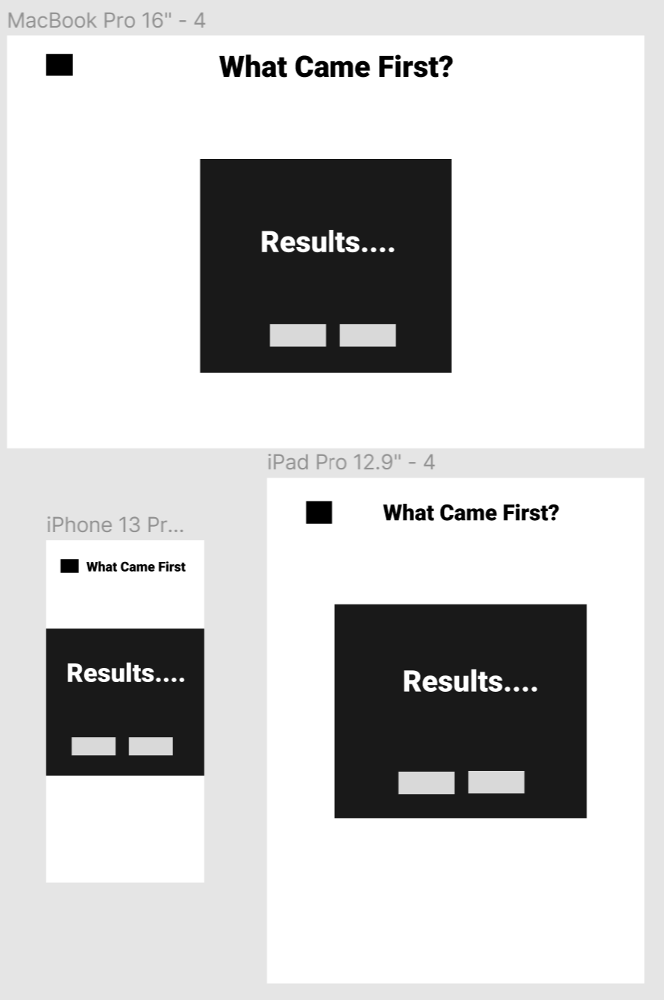
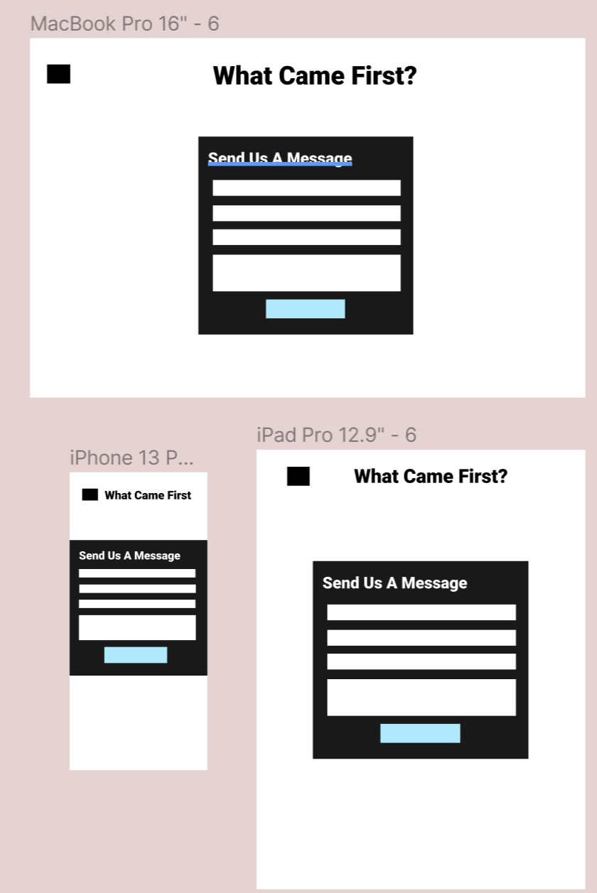

### Colour Scheme

The colour scheme I wanted to have neutral elements such as black and white partnered with bright colours for 'correct' and 'incorrect' answers. In addition to this, I selected sky blue crayola to be neutral between the Impreial red and Malachite green when trying to select an option. The blue also nicely connects on theme with sky featured in the historic illustration of the Egyptain Pyramids in the background.

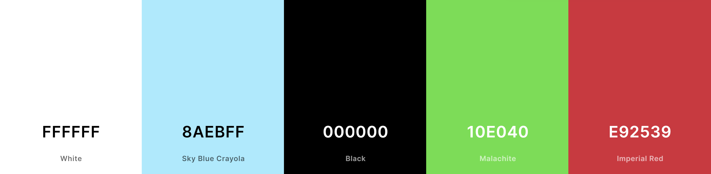

### Typography

Google Fonts: 

- The Header I wanted to be more illustrative and more of a delicate handwriting look to appear more historical. Therefore 'Dancing Script' was used.
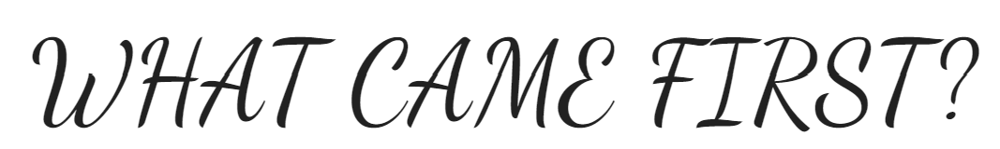

- The main body font, I wanted to be slightly more formal and easy to read questions and options in the quiz. I felt handwriting text would prove challenging for people with reading/ visual impairments. Therefore, I selected 'Josefin Sans'.
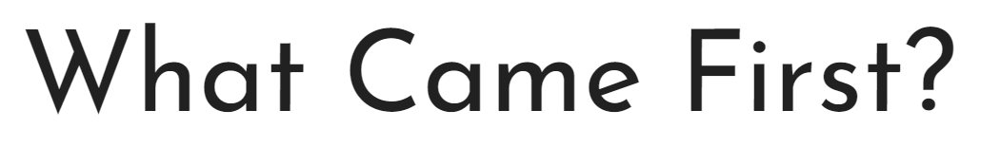

### Imagery

- For the website background, I wanted to have an ancient background. However, I wanted this to be more fun and educational appearing rather than a real life photo. 
The cartoon image of the pyramids felt perfect for a bright background and suiting the history theme well.

### Accessibility

## 3. Features

### Existing Features

- Header Title 
Header title always leads you back to the home page

- Temple Icon - Top Left
The Temple icon appears as a logo and also a drop down menu. 
- Welcome Container
- Javascript Modal containing Instructions
- Start Quiz Button 
- Introduction Container
- Continue and Exit Button 
- Questions Counter
- Time counter and Time Line that inceases
- hover effect on option
- Correct and Incorrect option
- Next Button Appears
- Results Container
- Javascript Contact Form

### Future Features

- More Questions 
- Add multiple difficulties 

### Why Certain Features Were Not Included

## 4. Technologies Applied

Languages:
- HTML 
- CSS
- Javascript

Other:

- FontAwesome - https://fontawesome.com/
- Flaticon - https://www.flaticon.com/free-icons/greek
- GoogleFonts - https://fonts.google.com/
- SmtpJS - https://smtpjs.com/
- Am I Responsive? - https://ui.dev/amiresponsive
- Grammarly - https://app.grammarly.com/
- freePik https://www.freepik.com/

## 5. Testing

### W3C Validator

### Lighthouse

As you can see, after conducting testing via Lighthouse. The website is showing strong results:

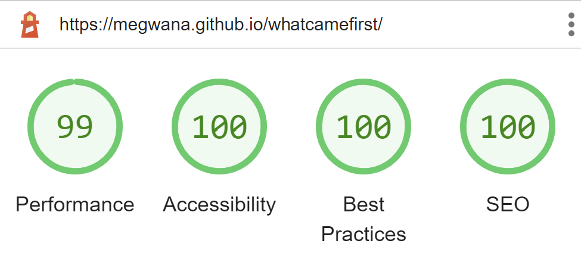
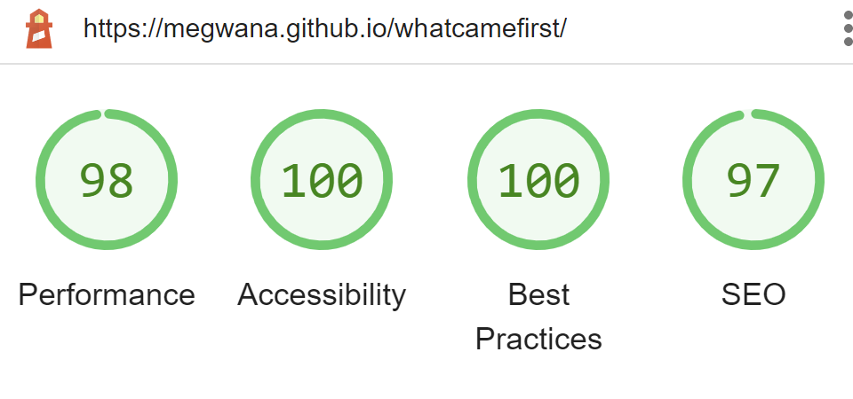
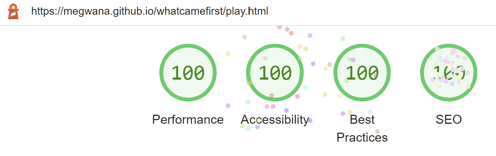
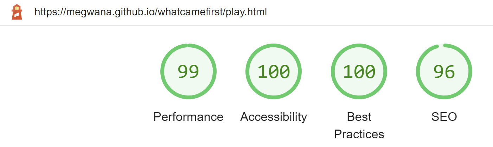
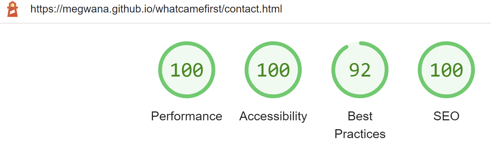
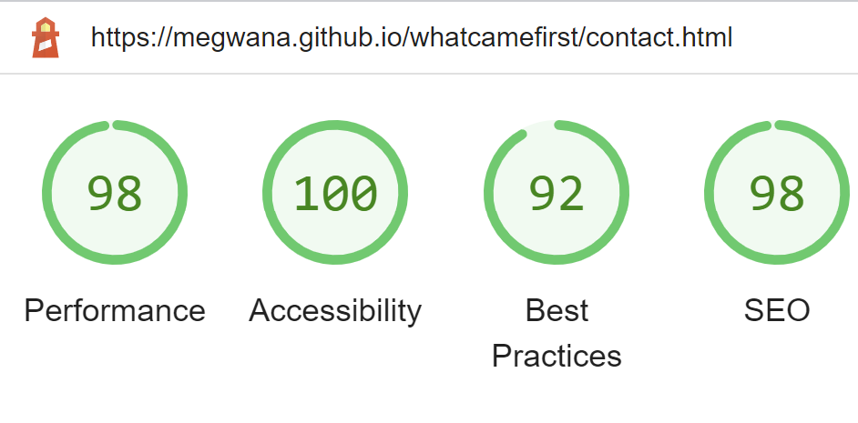

### Bugs

1. When deploying the website, I had an issue with the background image appearing and my play.css file linking. 

To fix this bug, I had to change the live site URLs from absolute and relative.

2. 

## 6. Deployment

## 7. Credits

Links Used:
- https://fontawesome.com/
- Google Fonts, including icon for Favicon "https://www.flaticon.com/free-icons/greek"
- Brian Design https://www.youtube.com/watch?v=f4fB9Xg2JEY
- Coding Nepal https://www.youtube.com/watch?v=WUBhpSRS_fk
- https://smtpjs.com/
- https://www.youtube.com/watch?v=KjQ8uvAt9kQ
- https://www.w3schools.com/
